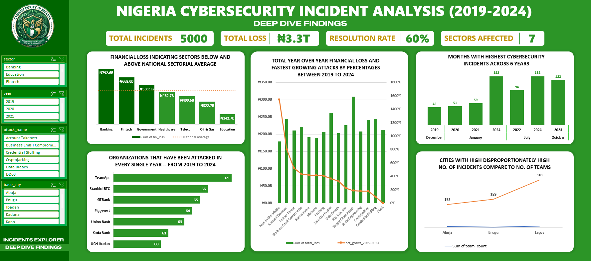
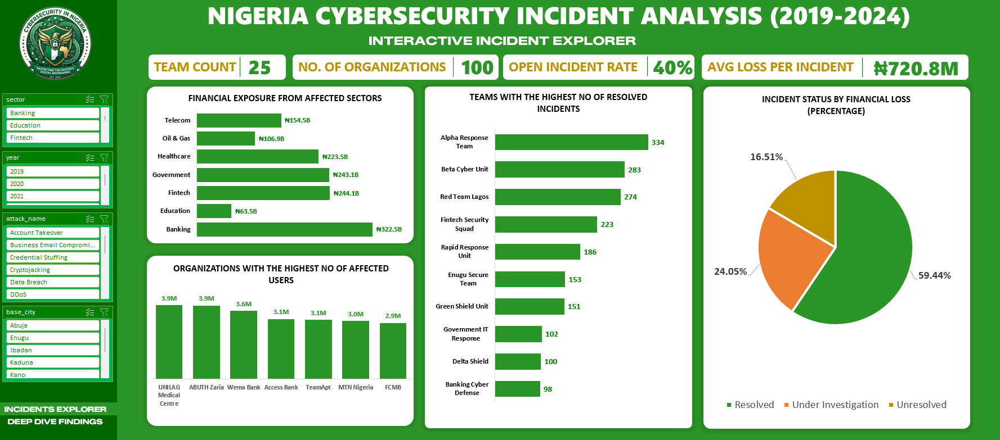

# Nigeria Cybersecurity Incident Analysis (2019–2024)

A SQL-driven analysis of cybersecurity incidents across Nigerian organizations from 2019 to 2024 — covering financial losses, attack trends, response team performance, and resource allocation gaps.

> **Note on the data:** The dataset is synthetic, generated using Claude AI to simulate realistic incident patterns drawn from documented trends in Nigeria's financial, telecom, government, and critical infrastructure sectors. It was built for analytical training purposes, not sourced from real breach records.

---

## Key Findings

- **Banking sector** suffered the highest financial losses of any sector affected by cyber attacks.
- **January** consistently produced the highest number of incidents across all 6 years — a clear seasonal pattern.
- **₦1.4 trillion** in financial losses across all sectors remains unrecovered (unresolved or under investigation).
- **Man-in-the-Middle attacks** are the fastest-growing threat type, with financial losses up **1,541%** between 2019 and 2024.
- **Lagos** has the highest incident-to-response-team ratio in the country, signaling a resourcing gap.
- **Team Apt** was attacked every single year from 2019–2024 — the most persistently targeted team in the dataset.

---

## Dataset Overview

Four related tables, structured as a central fact table with three reference tables:

| Table | Key Columns | Rows |
|---|---|---|
| `incidents` | incident_id (PK), incident_date, org_id, attack_type_id, severity, status, financial_loss_ngn, affected_users, resolution_time_hours, team_id | 5,050 |
| `organizations` | org_id (PK), org_name, sector, city | 100 |
| `attack_types` | attack_type_id (PK), attack_name, description, default_severity | 15 |
| `response_teams` | team_id (PK), team_name, base_city, status | 25 |

**Relationships:**
- `incidents.org_id` → `organizations.org_id`
- `incidents.attack_type_id` → `attack_types.attack_type_id`
- `incidents.team_id` → `response_teams.team_id`

---

## Research Questions

1. What percentage of financial loss is attributable to each incident status?
2. Which top 3 teams have the highest number of resolved incidents?
3. Which organization has the highest number of affected users?
4. Which sectors exceed the national average sector loss, and by how much?
5. What is the year-over-year change in financial loss by attack type (2019–2024), and which types are growing fastest?
6. Which months consistently produce the highest incident counts, and is there a seasonal pattern?
7. Which organizations were attacked in every year from 2019–2024?
8. What is the unrecovered financial exposure per sector from unresolved/under-investigation incidents?
9. Which cities have a disproportionately high incident-to-response-team ratio?

---

## Methodology

**Tooling:** Microsoft SQL Server Management Studio (SSMS) for querying; Excel for dashboarding.

**Data cleaning:**
- Removed 50 duplicate rows from `incidents` using `ROW_NUMBER()`
- Standardized inconsistent `severity` and `status` casing using `UPDATE` with `LOWER()` / `CASE`
- Handled NULLs in `financial_loss_ngn` and `affected_users` using `ISNULL()`
- Corrected invalid negative `resolution_time_hours` values
- Standardized `sector` and `city` casing in `organizations`
- Added foreign key constraints across all four tables to enforce referential integrity

**SQL techniques applied:**

| Category | Techniques |
|---|---|
| Exploration | `SELECT`, `COUNT(*)`, `MIN()`, `MAX()`, `AVG()`, `SELECT DISTINCT` |
| Filtering & Sorting | `WHERE`, `ORDER BY`, `TOP N`, `BETWEEN`, `IS NULL` |
| Aggregation | `GROUP BY`, `HAVING`, `SUM()`, `COUNT()`, `AVG()` |
| Joins | `INNER JOIN` across all 4 tables, `LEFT JOIN` for NULL checks |
| Subqueries / CTEs | `WITH`, multiple chained CTEs, derived tables |
| Window Functions | `RANK()`, `ROW_NUMBER()`, `LAG()`, `FIRST_VALUE()`, `LAST_VALUE()`, `SUM() OVER()`, `PARTITION BY` |
| Advanced | `CASE WHEN`, `CAST()`, `ISNULL()`, `UPDATE`, `ALTER TABLE` |
| Views | `CREATE VIEW` for dashboard-ready datasets |

---

## Dashboard

A two-layer Excel dashboard separates exploratory pivot-table analysis from the static, SQL-derived findings used in the final presentation.




---

## Recommendations

- Increase cybersecurity investment and monitoring in banking, telecom, government, and critical infrastructure sectors.
- Run security audits, staff awareness training, and vulnerability assessments at the start of each year — ahead of the January spike.
- Reduce investigation/resolution times to shrink unrecovered financial losses.
- Adopt MFA, encryption, secure communication protocols, and Zero Trust frameworks to counter the rise in Man-in-the-Middle attacks.
- Deploy additional response teams to high-ratio cities, particularly Lagos.
- Apply continuous threat monitoring and penetration testing for repeatedly targeted organizations.

---

## Challenges & Solutions

- **Duplicates:** Identified and removed using `ROW_NUMBER()`.
- **Inconsistent text values:** Standardized `severity`/`status` fields with `UPDATE` + `CASE`.
- **Missing values:** Handled with `ISNULL()` on financial loss and affected-user counts.
- **Invalid data:** Corrected negative `resolution_time_hours` entries.
- **Naming inconsistency:** Normalized `sector`/`city` casing for reliable grouping.
- **Referential integrity:** Enforced via foreign key constraints across all tables.
- **Complex, multi-table questions:** Solved using joins, CTEs, subqueries, and window functions.

---

## Repository Structure

```
Nigerian-National-Cybersecurity/
├── README.md
├── files/
│   ├── incidents.csv
│   ├── organizations.csv
│   ├── attack_types.csv
│   └── response_teams.csv
├── sql/
│   └── queries.sql
├── dashboard/
│   ├── cybersecurity_dashboard.xlsx
│   ├── dashboard_1.png
│   └── dashboard_2.png
└── Presentation/
    └── Nigeria_Cybersecurity_Capstone_v3.pptx
```

---

## SQL Queries

Full queries are in [`sql/queries.sql`](sql/queries.sql). Summary below:

<details>
<summary><strong>RQ1 — % financial loss per incident status</strong></summary>

```sql
WITH loss_per_status AS (
    SELECT status, SUM(financial_loss_ngn) AS total_loss
    FROM incidents
    GROUP BY status
),
full_loss AS (
    SELECT SUM(total_loss) AS tl FROM loss_per_status
)
SELECT status,
       ROUND(total_loss / (SELECT tl FROM full_loss) * 100, 2) AS pct_loss
FROM loss_per_status;
```
</details>

<details>
<summary><strong>RQ2 — Top 3 teams by resolved incidents</strong></summary>

```sql
SELECT TOP 3
    r.team_name,
    COUNT(i.incident_id) AS incident_count
FROM response_teams r
JOIN incidents i ON r.team_id = i.team_id
WHERE i.status = 'Resolved'
GROUP BY r.team_name
ORDER BY incident_count DESC;
```
</details>

<details>
<summary><strong>RQ3 — Organization with the most affected users</strong></summary>

```sql
SELECT TOP 1
    org_name,
    SUM(affected_users) AS affected_users
FROM organizations o
JOIN incidents i ON i.org_id = o.org_id
GROUP BY org_name
ORDER BY affected_users DESC;
```
</details>

<details>
<summary><strong>RQ4 — Sectors above national average loss</strong></summary>

```sql
WITH highest_affected_sectors AS (
    SELECT sector, SUM(financial_loss_ngn) AS financial_loss
    FROM incidents i
    JOIN organizations o ON i.org_id = o.org_id
    GROUP BY sector
),
national_average AS (
    SELECT AVG(financial_loss) AS avg_loss FROM highest_affected_sectors
)
SELECT sector,
       ROUND(financial_loss, 2) AS fin_loss,
       (SELECT avg_loss FROM national_average) AS national_average,
       ROUND(financial_loss - (SELECT avg_loss FROM national_average), 2) AS difference,
       CASE WHEN financial_loss > (SELECT avg_loss FROM national_average)
            THEN 'Above Average' ELSE 'Below Average' END AS status
FROM highest_affected_sectors
GROUP BY financial_loss, sector
ORDER BY fin_loss DESC;
```
</details>

<details>
<summary><strong>RQ5 — YoY financial loss change by attack type</strong></summary>

```sql
SELECT attack_name, year, total_loss, previous_year,
       ROUND((loss_2024 - loss_2019) / NULLIF(loss_2019, 0) * 100, 2) AS pct_growth_2019_2024
FROM (
    SELECT attack_name, year, total_loss,
           FIRST_VALUE(total_loss) OVER (
               PARTITION BY attack_name ORDER BY year
               ROWS BETWEEN UNBOUNDED PRECEDING AND UNBOUNDED FOLLOWING
           ) AS loss_2019,
           LAST_VALUE(total_loss) OVER (
               PARTITION BY attack_name ORDER BY year
               ROWS BETWEEN UNBOUNDED PRECEDING AND UNBOUNDED FOLLOWING
           ) AS loss_2024,
           LAG(total_loss) OVER (PARTITION BY attack_name ORDER BY year ASC) AS previous_year
    FROM (
        SELECT attack_name, YEAR(incident_date) AS year,
               ROUND(SUM(financial_loss_ngn), 2) AS total_loss
        FROM incidents i
        JOIN attack_types a ON i.attack_type_id = a.attack_type_id
        GROUP BY attack_name, YEAR(incident_date)
    ) AS attack_year
) AS pct
ORDER BY attack_name, year ASC;
```
</details>

<details>
<summary><strong>RQ6 — Months with consistently highest incidents</strong></summary>

```sql
WITH consistent AS (
    SELECT DATENAME(MONTH, incident_date) AS month,
           YEAR(incident_date) AS year,
           COUNT(incident_id) AS incident_count,
           RANK() OVER (
               PARTITION BY YEAR(incident_date)
               ORDER BY COUNT(incident_id) DESC
           ) AS rn
    FROM incidents
    GROUP BY DATENAME(MONTH, incident_date), YEAR(incident_date)
)
SELECT * FROM consistent WHERE rn = 1;
```
</details>

<details>
<summary><strong>RQ7 — Organizations attacked every year (2019–2024)</strong></summary>

```sql
WITH attacked_org AS (
    SELECT org_name, YEAR(incident_date) AS year,
           COUNT(incident_id) AS incident_count
    FROM organizations o
    JOIN incidents i ON o.org_id = i.org_id
    GROUP BY org_name, YEAR(incident_date)
)
SELECT org_name, SUM(incident_count) AS total_incidents
FROM attacked_org
GROUP BY org_name
HAVING COUNT(year) = 6
ORDER BY total_incidents DESC;
```
</details>

<details>
<summary><strong>RQ8 — Unrecovered financial exposure per sector</strong></summary>

```sql
WITH total_status_loss AS (
    SELECT sector, status, SUM(financial_loss_ngn) AS total_loss
    FROM organizations o
    JOIN incidents i ON o.org_id = i.org_id
    GROUP BY sector, status
),
total_loss AS (
    SELECT sector, SUM(total_loss) AS loss
    FROM total_status_loss
    GROUP BY sector
),
unrecovered_loss AS (
    SELECT sector, SUM(total_loss) AS loss
    FROM total_status_loss
    WHERE status IN ('Unresolved', 'Under Investigation')
    GROUP BY sector
)
SELECT tl.sector,
       ul.loss AS unrecovered_loss,
       tl.loss AS total_loss,
       ROUND((ul.loss / tl.loss * 100), 2) AS unrecovered_pct,
       RANK() OVER (ORDER BY ul.loss DESC) AS f_e_rank
FROM unrecovered_loss ul
JOIN total_loss tl ON ul.sector = tl.sector
ORDER BY f_e_rank ASC;
```
</details>

<details>
<summary><strong>RQ9 — Cities with disproportionate incident-to-team ratio</strong></summary>

```sql
WITH teams AS (
    SELECT rt.team_name AS team_name,
           rt.base_city AS city,
           COUNT(incident_id) AS no_of_incidents
    FROM response_teams rt
    LEFT JOIN incidents i ON rt.team_id = i.team_id
    GROUP BY rt.team_name, rt.base_city
),
national_average AS (
    SELECT AVG(no_of_incidents) AS avg FROM teams
),
team_count AS (
    SELECT city, COUNT(team_name) AS team_count, SUM(no_of_incidents) AS incidents
    FROM teams
    GROUP BY city
),
proportion AS (
    SELECT city, team_count, ROUND((incidents / team_count), 2) AS proportion
    FROM team_count
)
SELECT * FROM proportion
WHERE proportion > (SELECT avg FROM national_average)
ORDER BY proportion DESC;
```
</details>

---

## Tech Stack

- **SQL Server (T-SQL)** — querying, CTEs, window functions, views
- **Excel** — dashboarding and pivot analysis
- **PowerPoint** — capstone presentation

---

*Capstone project for The Data Incubator (TDI) — Emerald Cohort.*
